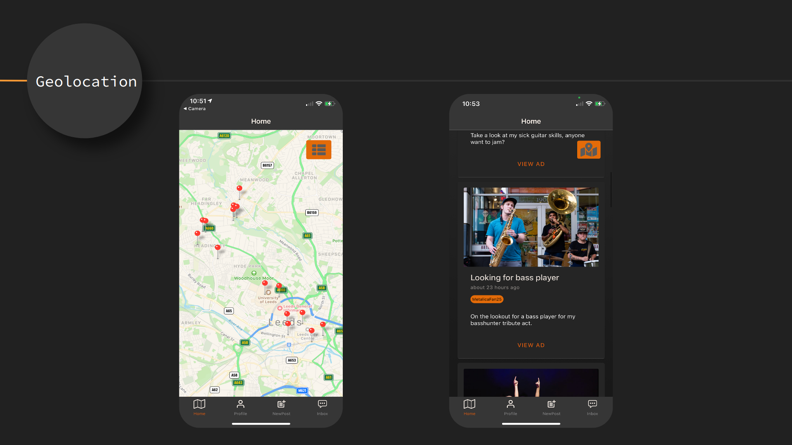
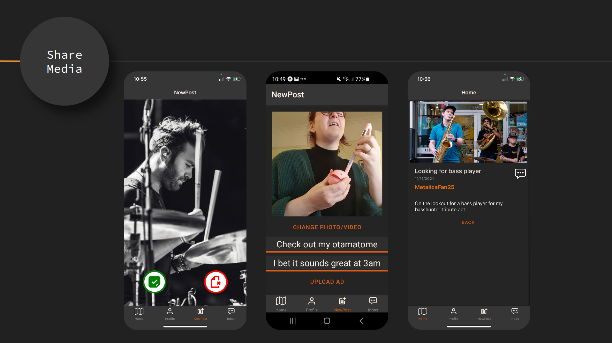
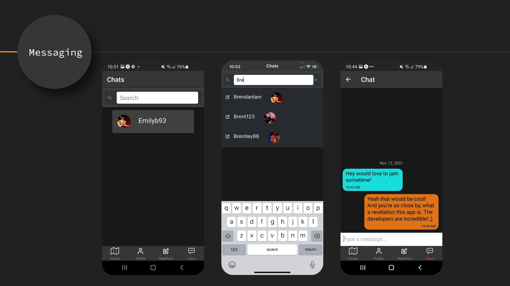
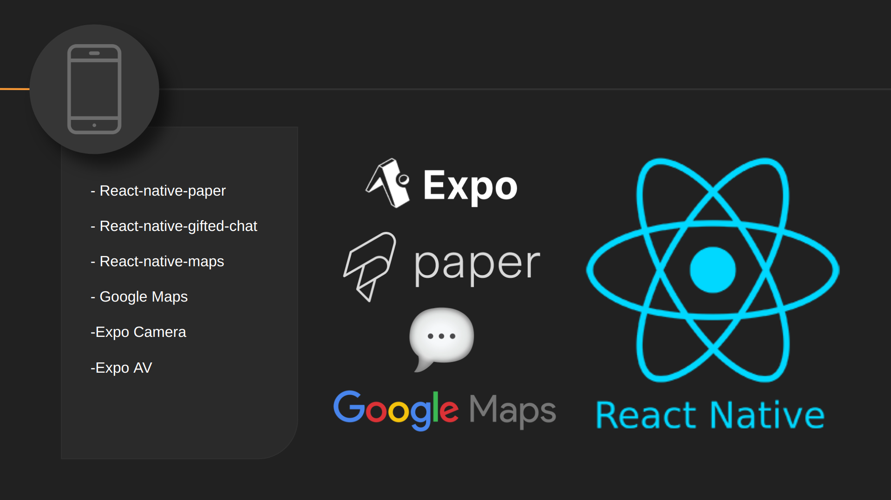
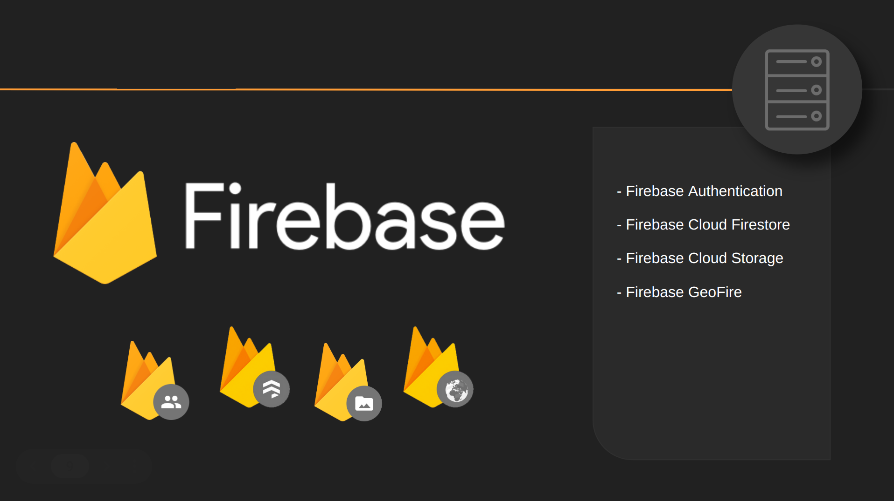

# Amplify

Amplify is a social media community mobile app, designed to connect local musicians through geolocation.

A user-friendly UI that takes inspiration from the best parts of bigger social media apps. Amplify enables our users to show off and advertise their skills through in-app videos and connect with other musicians through in-app messaging services.

## Watch the [product demo](https://www.youtube.com/watch?v=VH3ZniWAMrA&t=188s)

&ensp;

&ensp;

## Frontend Technologies

&ensp;

## Backend Technologies

